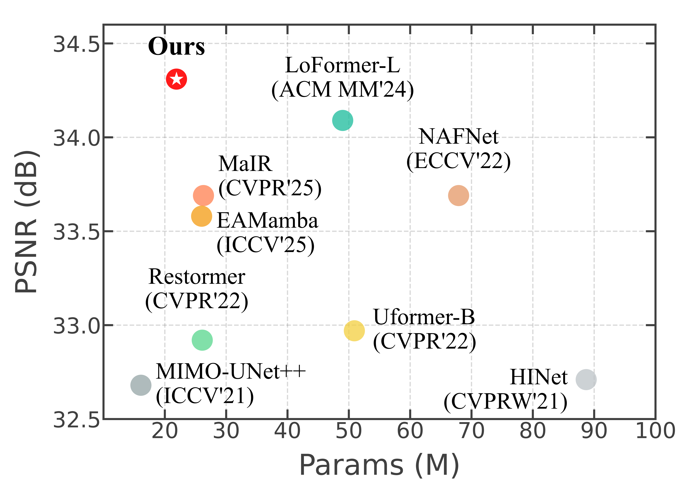
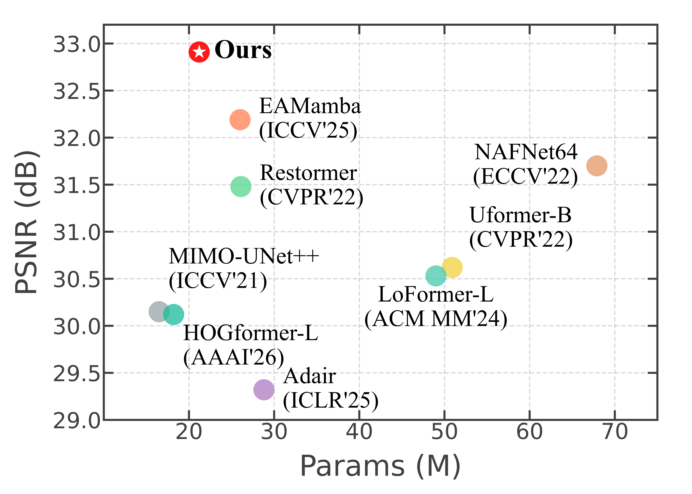
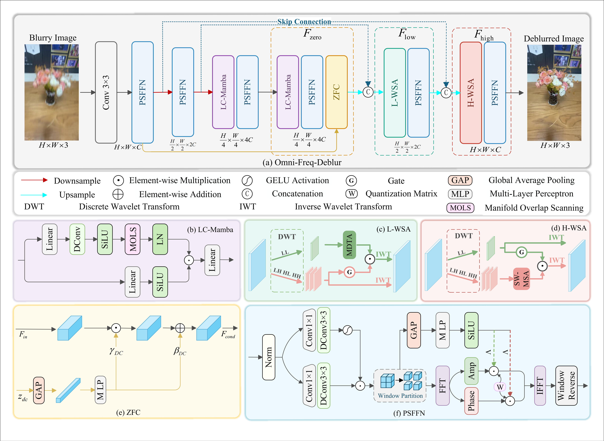

<div align="center">

# Omni-Freq-Deblur: Capturing Omni-Frequency for 2D and 3D Scene Deblurring

**[Quankai Zhao](https://github.com/zhaoquankai)**<sup>1</sup>, Bo Jiang<sup>1</sup>, Tianle Xie<sup>1</sup>, Wenpeng Qiu<sup>1</sup>, Haoxiang Wang<sup>1</sup>, Yuzhuo Wang<sup>1</sup>, Xin Dang<sup>1</sup>, Xiaoxuan Chen<sup>1</sup>, Yaowei Li<sup>1</sup>

<sup>1</sup>School of Electronic and Information Engineering, Northwest University

[](#-datasets)
[](#-quick-start--usage)

</div>

---

## 📖 Abstract

Current deblurring methods, despite achieving remarkable performance on 2D scenes, often suffer from band-limited frequency recovery and an inability to handle 3D scenes. Unlike 2D blur, 3D blur is driven by six-degree-of-freedom (6-DoF) camera motion, which results in spatially-variant distortions where pixel displacement is intrinsically entangled with scene depth. To address this challenge, we propose **Omni-Freq-Deblur**, a unified framework that casts both 2D and 3D scene deblurring as an explicit spectral reconstruction problem. 

The framework decomposes the deblurring process into three complementary frequency bands:
1. A zero-frequency global rectification utilizes **Zero-Frequency Calibration (ZFC)** to rectify global distortions. 
2. A low-frequency structural enhancement employs **Low-Frequency Wavelet Self-Attention (L-WSA)** to reconstruct the coherent structural skeleton. 
3. A high-frequency textural refinement leverages **High-Frequency Wavelet Self-Attention (H-WSA)** to precisely recover fine-grained textures. 

Extensive experiments demonstrate that Omni-Freq-Deblur achieves state-of-the-art performance on multiple 2D deblurring datasets and recent 3D deblurring benchmarks. Furthermore, its efficacy as a geometrically consistent prior significantly suppresses artifacts in downstream 3D reconstruction tasks, validating its potential as a universal deblurring baseline.

---

## 💡 Motivation: 2D vs. 3D Scene Deblurring

<p align="center">
  
  
  <br>
  <em>Figure 1: Comparison of restoration performance on standard 2D (GoPro) and 3D (GS-Blur) benchmarks. Our method effectively captures omni-frequency information to recover sharp textures in both domains.</em>
</p>

---

## 🚀 Network Architecture

<p align="center">
  
  <br>
  <em>Figure 2: The pipeline of Omni-Freq-Deblur. By performing explicit spectral reconstruction, our model handles the depth-dependent blur in 3D scenes more effectively than spatial-only methods.</em>
</p>

---

## 🤝 Visual Comparisons 

We present dynamic visual comparisons below, alternating between blurred inputs and our sharp, reconstructed outputs to demonstrate the restoration performance.

<div align="center">
  <h3>Case 1: GoPro Benchmark (2D Dynamic Scene)</h3>
  
  <br><br>
  <h3>Case 2: GS-Blur Benchmark (3D Gaussian Splatting)</h3>
  
</div>

---

## 📊 Quantitative Results

Our model demonstrates state-of-the-art performance with a highly competitive parameter footprint (**21.9M**). The best and second-best results are highlighted in **bold** and <u>underlined</u>, respectively.

<div style="font-size: 90%; line-height: 1.2;">
<p align="center">
  <b>Table 1: 3D Scene Deblurring Comparisons (GS-Blur & Deblur-NeRF)</b>
</p>
<table style="width: 100%; table-layout: fixed; margin: 0 auto; border-collapse: collapse;" align="center">
  <thead>
    <tr style="border-bottom: 1px solid #ccc;">
      <th style="width: 15%;">Method</th>
      <th style="width: 10%;">Venue</th>
      <th style="width: 10%;">Params</th>
      <th style="width: 25%;">GS-Blur (PSNR↑/SSIM↑)</th>
      <th style="width: 40%;">Deblur-NeRF (PSNR↑/SSIM↑) | + 3DGS (PSNR↑/SSIM↑)</th>
    </tr>
  </thead>
  <tbody>
    <tr>
      <td>Restormer</td>
      <td>CVPR'22</td>
      <td>26.1M</td>
      <td>31.48 / 0.921</td>
      <td>27.11 / 0.888 | 30.17 / 0.934</td>
    </tr>
    <tr>
      <td>NAFNet64</td>
      <td>ECCV'22</td>
      <td>67.9M</td>
      <td>31.70 / 0.919</td>
      <td>26.92 / 0.885 | 30.31 / <u>0.935</u></td>
    </tr>
    <tr>
      <td>EAMamba</td>
      <td>ICCV'25</td>
      <td>26.0M</td>
      <td><u>32.19</u> / <u>0.950</u></td>
      <td><u>27.40</u> / <u>0.892</u> | 30.23 / <u>0.935</u></td>
    </tr>
    <tr style="background-color: #f9f9f9;">
      <td><b>Omni-Freq-Deblur</b></td>
      <td><b>Ours</b></td>
      <td><b>21.9M</b></td>
      <td><b>32.91 / 0.957</b></td>
      <td><b>27.52 / 0.894</b> | <b>30.57 / 0.937</b></td>
    </tr>
  </tbody>
</table>

<br>
<p align="center">
  <b>Table 2: 2D Scene Deblurring Comparisons (GoPro & HIDE)</b>
</p>
<table style="width: 85%; table-layout: fixed; margin: 0 auto; border-collapse: collapse;" align="center">
  <thead>
    <tr style="border-bottom: 1px solid #ccc;">
      <th style="width: 20%;">Method</th>
      <th style="width: 15%;">Venue</th>
      <th style="width: 15%;">Params</th>
      <th style="width: 25%;">GoPro (PSNR↑/SSIM↑)</th>
      <th style="width: 25%;">HIDE (PSNR↑/SSIM↑)</th>
    </tr>
  </thead>
  <tbody>
    <tr>
      <td>Restormer</td>
      <td>CVPR'22</td>
      <td>26.1M</td>
      <td>32.92 / 0.961</td>
      <td>31.22 / 0.942</td>
    </tr>
    <tr>
      <td>NAFNet</td>
      <td>ECCV'22</td>
      <td>67.9M</td>
      <td>33.69 / 0.967</td>
      <td>31.31 / 0.943</td>
    </tr>
    <tr>
      <td>EAMamba</td>
      <td>ICCV'25</td>
      <td>26.0M</td>
      <td><u>33.58</u> / <u>0.966</u></td>
      <td><u>31.42</u> / <u>0.944</u></td>
    </tr>
    <tr style="background-color: #f9f9f9;">
      <td><b>Omni-Freq-Deblur</b></td>
      <td><b>Ours</b></td>
      <td><b>21.9M</b></td>
      <td><b>34.31 / 0.970</b></td>
      <td><b>32.00 / 0.950</b></td>
    </tr>
  </tbody>
</table>
</div>

---

## ⚡ Quick Start & Usage

<table>
  <tr>
    <td width="25%"><b>🛠️ Installation</b></td>
    <td>
      <pre><code class="language-bash">git clone https://github.com/zhaoquankai/Omni-Freq-Deblur.git
cd Omni-Freq-Deblur
conda create -n omnifreq python=3.10 -y
conda activate omnifreq
pip install -r requirements.txt
python setup.py develop</code></pre>
    </td>
  </tr>
  <tr>
    <td><b>🏃 Training</b></td>
    <td>
      To train the model on the datasets, simply execute the provided shell script:
      <pre><code class="language-bash">bash train.sh</code></pre>
    </td>
  </tr>
  <tr>
    <td><b>🧪 Evaluation</b><br><br><i>Pre-trained Models:<br><a href="https://drive.google.com/drive/folders/1o1bZ26RbTPExVZ6YCyGTP3t_yt_blxtJ?usp=sharing">Download Here</a></i></td>
    <td>
      To evaluate our pre-trained model (e.g., on GSBlur), use the following DDP testing command. You can easily override the default paths via command-line arguments:
      <pre><code class="language-bash">torchrun --nproc_per_node=2 test.py \
  --dataroot_lq ./datasets/GSBlur/test/input_noise \
  --dataroot_gt ./datasets/GSBlur/test/target \
  --test_model ./experiments/pretrained_models/GSblur.pth \
  --model_width 48 \
  --num_workers 8</code></pre>
    </td>
  </tr>
</table>

---

## 📂 Datasets

Download links for evaluated benchmarks:
* [GoPro](https://seungjunnah.github.io/Datasets/gopro.html) | [HIDE](https://github.com/joanshen0508/Hide-Dataset) | [Lai RealWorld](https://github.com/phoenix104104/cvpr16_deblur_study) | [DeRF](https://github.com/limacv/Deblur-NeRF) | [GS-Blur](https://openreview.net/forum?id=Awu8YlEofZ)

### Dataset Organization
```text
Omni-Freq-Deblur/
├── datasets/
│   ├── GoPro/
│   ├── Lai2025/
│   └── GSBlur/
│       ├── test/
│       │   ├── input_noise/
│       │   └── target/
